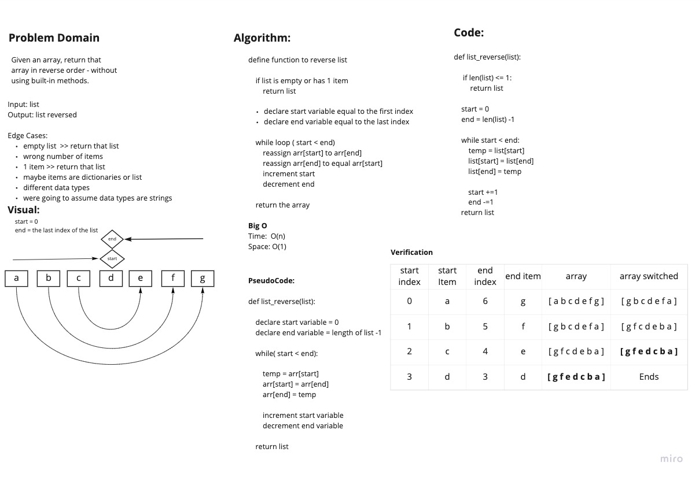

# Reverse an Array
<!-- Description of the challenge -->
Given a list, reverse the list in place

## Whiteboard Process
<!-- Embedded whiteboard image -->

## Approach & Efficiency
<!-- What approach did you take? Discuss Why. What is the Big O space/time for this approach? -->

The approach we took was to declare a start_index variable and an end_index variable, which corresponds to the first index in the list, and the last index in the list. We ran a while loop in order to flip the first item and last item, then incremented the start_index variable and decremented the last_index variable, so on the next loop it would look at the next pair and continue to flip until the pointers reach each other in the middle. We took this approach because we thought it was the most efficient. It does not require any extra space, and it has an O(n) for time.

Big O:

- Time: O(n)
- Space: O(n)
